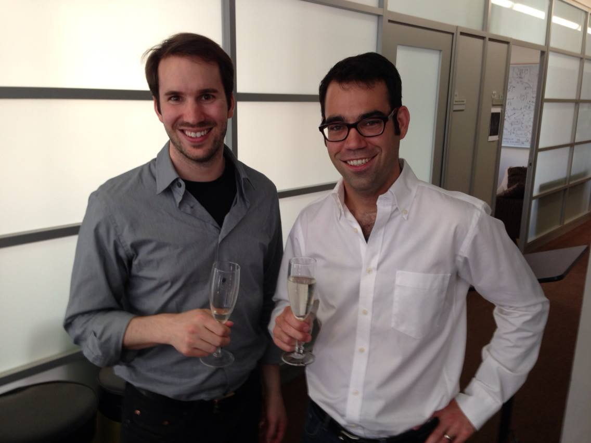

Title: George Lewis Graduates!
date: 2013-05-17
Authors: Kyle Cranmer
Category: Blog
Tags: graduation
Slug: News-from-05-17-2013
Summary:  George Herbert Lewis graduates with his Ph.D. based on his thesis entitled "Measurements and Searches for New Physics Using Top Quarks at the LHC"

 

 George Herbert Lewis graduates with his Ph.D. based on his thesis entitled "Measurements and Searches for New Physics Using Top Quarks at the LHC"

(Thanks for the nice bottle of whiskey George)

 