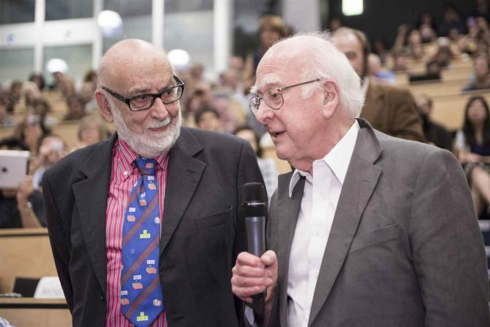

Title: Nobel Prize Celebration
date: 2013-10-08
Authors: Kyle Cranmer
Category: Blog, results
Tags: news, results, honors
Slug: News-from-10-08-2013
Summary: Nobel Prize Celebration

On Tuesday, October 8th, 2013, the Nobel Prize in Physics was <a href="http://www.nobelprize.org/nobel_prizes/physics/laureates/2013/">awarded</a> to François Englert and Peter Higgs...

<blockquote>
&quot;for the theoretical discovery of a mechanism that contributes to our understanding of the origin of mass of subatomic particles, and which recently was confirmed through the discovery of the predicted fundamental particle, by the ATLAS and CMS experiments at CERN's Large Hadron
Collider&quot;.
</blockquote>

The announcement happened to occur while the annual <a href="http://ruphe.fsac.ac.ma/AtlasWeek2013/index.php">ATLAS Overview Week</a> was being held in Marrakech, Morocco, and NYU Experimental Particle Physics Group members James Beacham and Kirill Prokofiev were in attendance and <a href="images/ATLASWeekMarrakechNobel2013.png">watched the announcement with hundreds of other ATLAS members</a>.  The whole room burst into applause upon hearing the announcement.

<!--

The announcement happened to occur while the annual <a href="http://ruphe.fsac.ac.ma/AtlasWeek2013/index.php">ATLAS Overview Week</a> was being held in Marrakech, Morocco, and NYU Experimental Particle Physics Group members James Beacham and Kirill Prokofiev were in attendance and <a href="images/ATLASWeekMarrakechNobel2013.png">watched the announcement with hundreds of other ATLAS members</a>.  The whole room burst into applause upon hearing the announcement.

-->

Back in New York, the rest of the group <a href="http://youtu.be/cxQKXRi_ezA">held a celebration in Meyer Hall</a>.  The mention of ATLAS in the official citation of the Nobel Prize made this a particularly proud moment for the entire collaboration and for our NYU group, since we played several key roles in the discovery.

