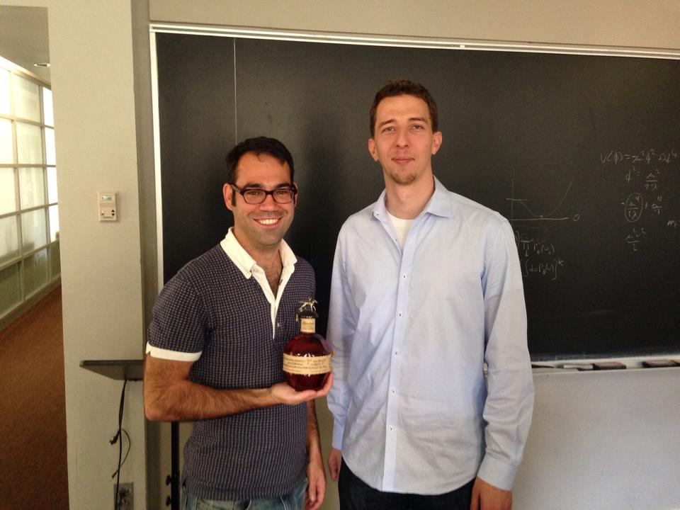

Title: Sven Kreiss Graduates!
date: 2014-05-17
Authors: Kyle Cranmer
Category: Blog
Tags: graduation
Slug: News-from-05-17-2014
Summary:  Sven Kreiss successfully defends his thesis on "Higgs Boson Discovery and First Property Measurements with the $H \to ZZ^* \to 4 \ell$ Channel and the Combination"

Sven Kreiss successfully defends his thesis on "Higgs Boson Discovery and First Property Measurements with the $H \to ZZ^* \to 4 \ell$ Channel and the Combination"

(Thanks for the nice bottle of whiskey Sven)

 