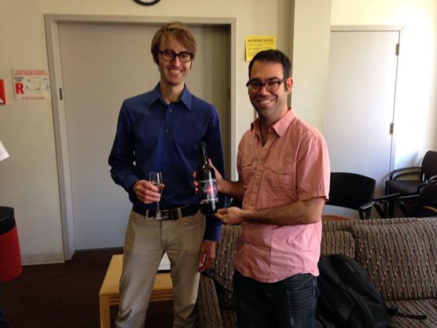

Title: James Beacham Graduates!
date: 2014-05-07
Authors: Kyle Cranmer
Category: Blog
Tags: graduation
Slug: News-from-05-07-2014
Summary:  James Beacham successfully defends his thesis on Exotic Higgs, Rare Z, and a Dark Photon: Searching for New Physics at the LHC, LEP, and Jefferson Lab"

James Beacham successfully defends his thesis on "Exotic Higgs, Rare Z, and a Dark Photon: Searching for New Physics at the LHC, LEP, and Jefferson Lab"

(Thanks for the Higgs boson beer James!)

 