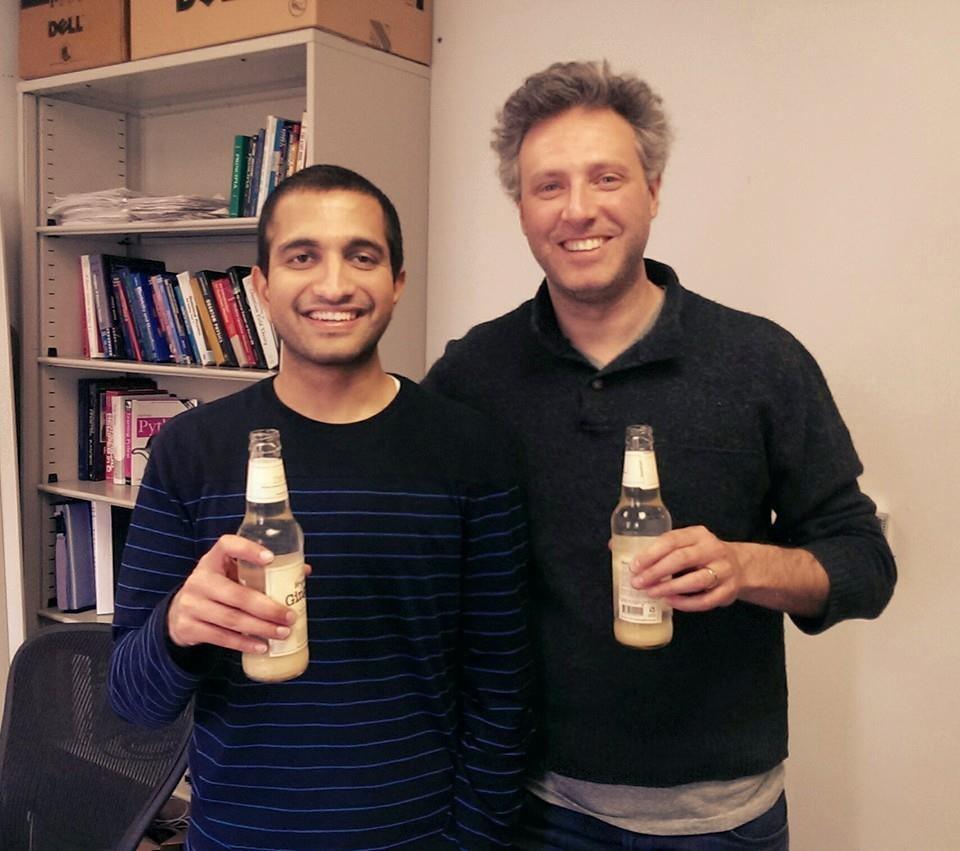

Title: Karthik Krishnaiyengar Graduates!
date: 2015-04-14
Authors: Kyle Cranmer
Category: Blog
Tags: graduation
Slug: News-from-04-14-2015
Summary:  Karthik Krishnaiyengar successfully defends his thesis on "Search for Higgs boson decays to neutralinos and gravitinos using the ATLAS detector"

Karthik Krishnaiyengar successfully defends his thesis on "Search for Higgs boson decays to neutralinos and gravitinos using the ATLAS detector"

 