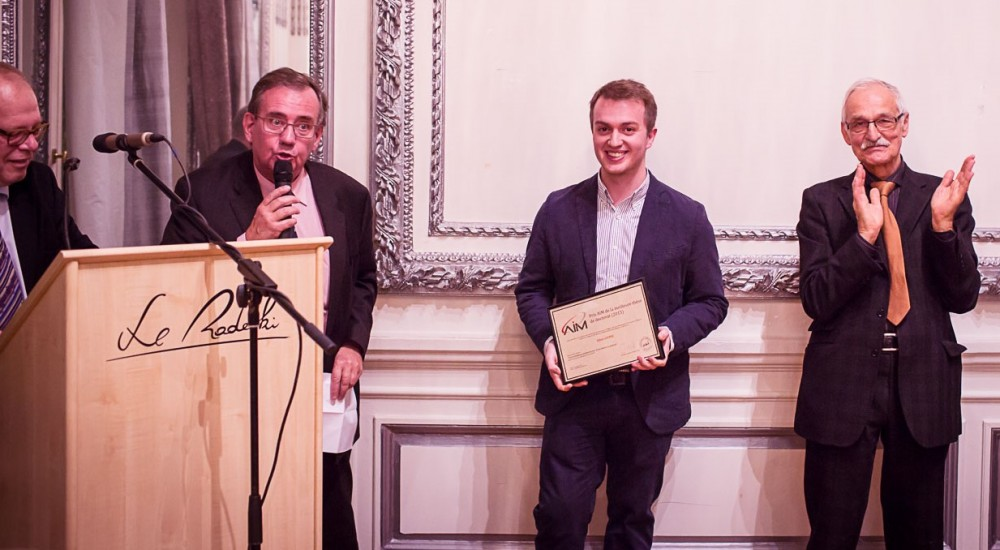

Title: Gilles Louppe wins AIM thesis award
date: 2015-11-27
Authors: Kyle Cranmer
Category: Blog
Tags: honors
Slug: News-from-11-27-2015
Summary: Gilles Louppe wins AIM thesis award

Gilles Louppe [won the AIM thesis award](http://aimontefiore.org/prix/) for his thesis entitled "Understanding Random Forests: From Theory to Practice". The award was established by George Montefiore and recognizes a PhD thesis defended in the past year at the Montefiore Institute. The Doctoral College of the Institute selects among the candidates theses, three theses of greatest scientific interest. AIM, as part of its price, intends to highlight the societal aspect and industrial implications of the contents of the thesis. It is in this spirit that designates the best thesis.

