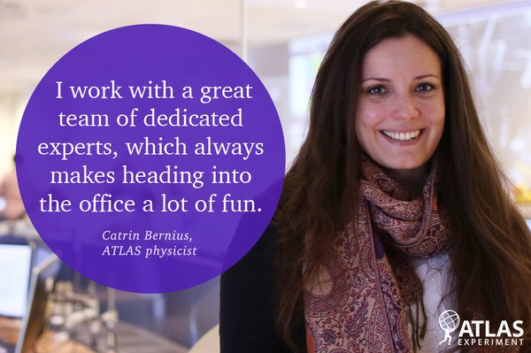

Title: Catrin Bernius featured for International Women's Day
date: 2016-03-08 
Authors: Kyle Cranmer
Category: Blog
Tags: honors
Slug: News-from-3-08-2016
Summary: Catrin Bernius featured for International Women's Day

Catrin Bernius was one of [seven inspiring women of the ATLAS experiment](http://atlas-public.web.cern.ch/updates/photo-essay/meet-7-inspiring-women-atlas-experiment) featured for a piece in celebration of International Women's Day 2016.

