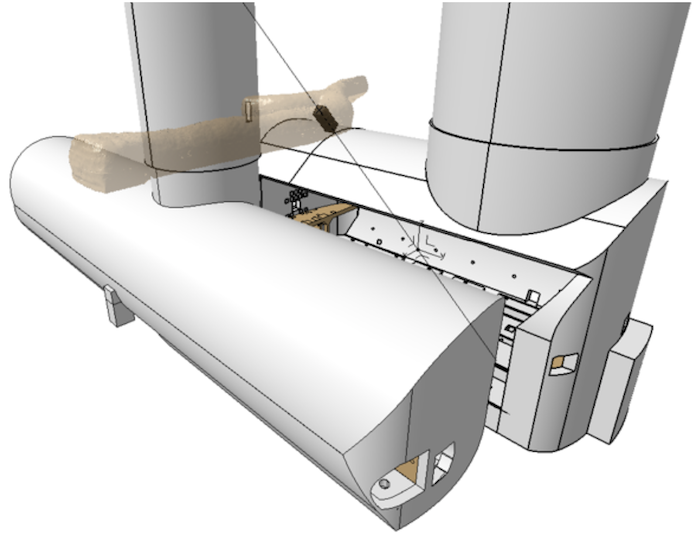

Title: MilliQan Letter of Intent
date: 2016-07-15
Authors: Kyle Cranmer
Category: Blog
Tags: Atlas
Slug: milliQan
Summary: MilliQan Letter of Intent

 
Andy Haas and collaborators submit a [Letter of Intent to Install a Milli-charged Particle Detector at LHC Point 5](https://arxiv.org/abs/1607.04669)

