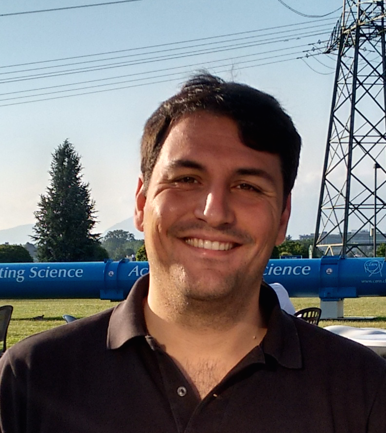

Title: Manfredi Ronzani joins The NYU group
date: 2017-11-01
Authors: Kyle Cranmer
Category: Blog
Tags: jobs
Slug: manfredi-joins
Summary: Manfredi Ronzani joins The NYU group as a postdoc working on SUSY searches and Missing ET triggers.
 

Nov 1, 2017: Manfredi Ronzani joins The NYU group as a postdoc working on SUSY searches and Missing ET triggers.
Welcome Manfredi!

  

  
Manfredi Ronzani, Research Scientist
 
  Interests: ATLAS: Supersymmetry, exotics, MET trigger.  
  Publications: <a href="http://inspirehep.net/search?p=author%3AM.Ronzani.1">INSPIRE</a> |
<a href="https://cdsweb.cern.ch/search?ln=en&p=ronzani%2C+manfredi&f=author&action_search=Search&c=CERN+Document+Server&sf=&so=d&rm=&rg=10&sc=1&of=hb">CERN</a> 

  Presentations: <a href="https://indico.cern.ch/search.py?categId=0&p=manfredi+ronzani&f=&collections=&startDate=&endDate=&sortField=&sortOrder=d">ATLAS</a>  

  

