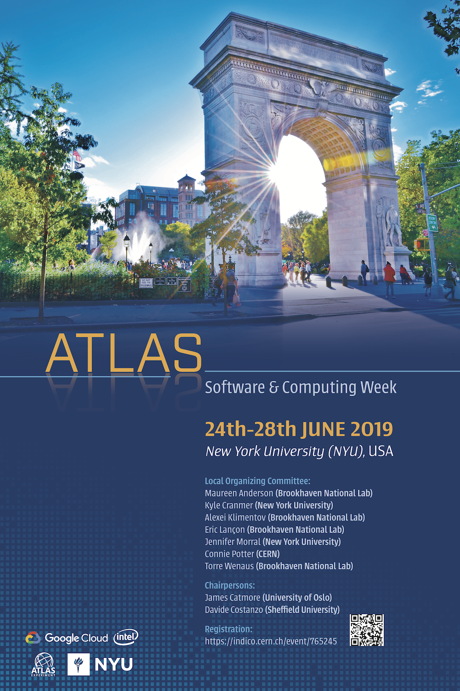

Title: NYU Hosts ATLAS Software & Computing Week
date: 2019-06-24
Authors: Kyle Cranmer
Category: Blog
Tags: events
Slug: atlas-sw-week-2019
Summary: NYU Hosts ATLAS Software & Computing Week
 
NYU Hosted the 2019 ATLAS Software & Computing Week. 

 * [Agenda](https://indico.cern.ch/event/765245/timetable/)
 * [Dr Vint Cerf video below](https://drive.google.com/file/d/1MkLMZY-dHsag2QetygnqArhZ5PxPaDXw/view?ts=5cfcf3ca)

<iframe src="https://drive.google.com/file/d/1MkLMZY-dHsag2QetygnqArhZ5PxPaDXw/preview" width="640" height="480"></iframe>